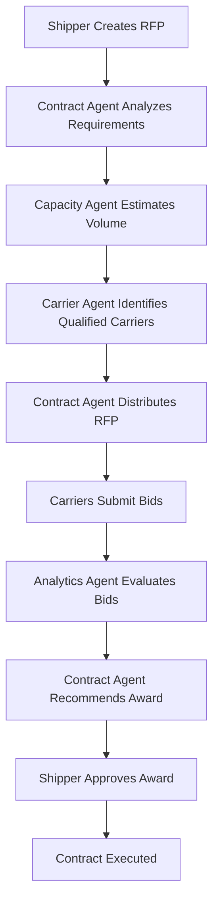
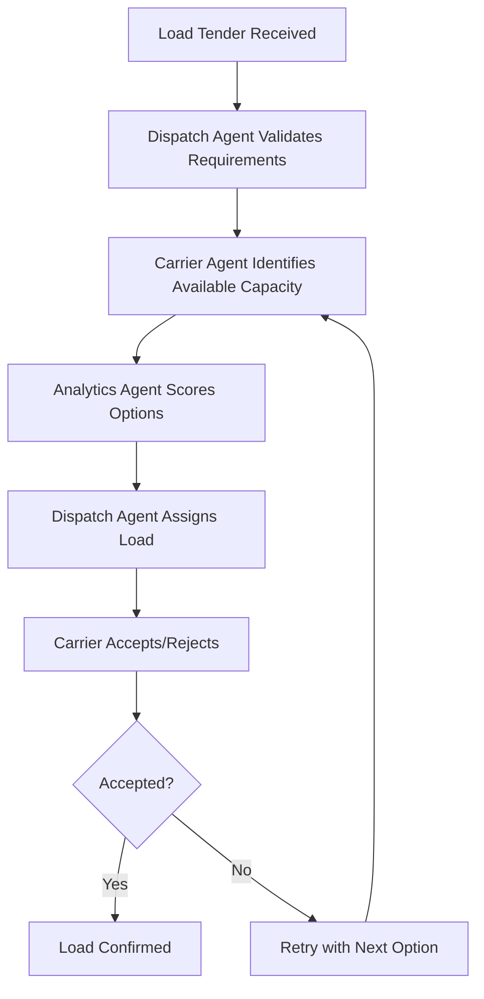
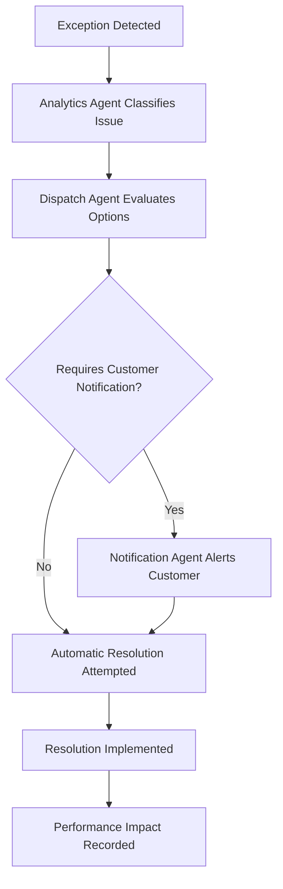

# Domain Analysis: AI-Native Transport Management System

## Domain Overview

The Transportation Management System (TMS) domain encompasses the complex ecosystem of freight brokerage, logistics coordination, and supply chain optimization. Our analysis focuses on transforming traditional TMS workflows into an AI-Agent Native architecture.

## 1. Core Domain Entities

### 1.1 Primary Entities

#### Load
```yaml
entity: Load
description: A shipment request requiring transportation
attributes:
  - load_id: unique identifier
  - origin: pickup location with geo-coordinates
  - destination: delivery location with geo-coordinates
  - commodity: freight description and classification
  - weight: total shipment weight
  - dimensions: length, width, height
  - pickup_date: scheduled pickup time
  - delivery_date: required delivery time
  - special_requirements: equipment type, handling instructions
  - status: tendered, assigned, in_transit, delivered, cancelled
  - rate: agreed transportation cost
business_rules:
  - Load must have valid origin and destination
  - Pickup date must be before delivery date
  - Weight cannot exceed legal limits
  - Special requirements must be validated against available equipment
```

#### Carrier
```yaml
entity: Carrier
description: Transportation service provider
attributes:
  - carrier_id: unique identifier
  - company_name: legal business name
  - mc_number: FMCSA Motor Carrier number
  - dot_number: Department of Transportation number
  - operating_authority: interstate/intrastate permissions
  - equipment_types: available truck/trailer configurations
  - service_areas: geographic coverage zones
  - capacity: available truck count
  - insurance_info: liability and cargo coverage
  - safety_rating: FMCSA safety score
  - performance_score: historical performance metrics
  - preferred_lanes: high-volume shipping lanes
  - rate_preferences: pricing structure and preferences
business_rules:
  - Must have valid MC and DOT numbers
  - Insurance must meet minimum requirements
  - Safety rating must meet company standards
  - Performance score affects load assignment priority
```

#### Shipper
```yaml
entity: Shipper
description: Customer requesting freight transportation
attributes:
  - shipper_id: unique identifier
  - company_name: business name
  - contact_info: primary contacts and communication preferences
  - billing_info: payment terms and credit rating
  - shipping_locations: facilities requiring pickup/delivery
  - preferred_carriers: approved carrier list
  - rate_agreements: contracted pricing structures
  - shipping_requirements: standard operating procedures
  - volume_commitments: guaranteed shipment volumes
business_rules:
  - Must have valid payment terms
  - Credit rating affects payment requirements
  - Volume commitments affect pricing tiers
  - Special requirements must be documented
```

#### Contract/RFP
```yaml
entity: Contract
description: Formal pricing agreement or request for proposal
attributes:
  - contract_id: unique identifier
  - shipper_id: requesting customer
  - lanes: origin-destination pairs with volumes
  - duration: contract start and end dates
  - rates: pricing by lane and service level
  - terms: payment, liability, and service terms
  - requirements: special handling or equipment needs
  - status: draft, pending, awarded, active, expired
  - bid_responses: carrier proposals and pricing
business_rules:
  - Contract must specify clear pricing terms
  - All lanes must have valid origin/destination
  - Duration cannot exceed regulatory limits
  - Award decisions must consider multiple factors
```

### 1.2 Supporting Entities

#### Route
```yaml
entity: Route
description: Optimized path between origin and destination
attributes:
  - route_id: unique identifier
  - waypoints: intermediate stops and coordinates
  - distance: total mileage
  - estimated_time: travel duration
  - toll_costs: highway toll expenses
  - fuel_costs: estimated fuel consumption
  - restrictions: weight/height/hazmat limitations
```

#### Rate
```yaml
entity: Rate
description: Pricing structure for transportation services
attributes:
  - rate_id: unique identifier
  - base_rate: core transportation cost
  - fuel_surcharge: variable fuel adjustment
  - accessorials: additional service charges
  - currency: pricing currency (USD, CAD, etc.)
  - effective_dates: rate validity period
  - rate_type: spot, contract, or tariff pricing
```

## 2. Domain Processes

### 2.1 RFP Management Process


### 2.2 Load Assignment Process


### 2.3 Exception Management Process


## 3. Business Rules and Constraints

### 3.1 Regulatory Compliance
- All carriers must maintain valid operating authority
- Driver hours of service regulations must be enforced
- Weight limits must be validated against route restrictions
- Hazardous materials require special certification

### 3.2 Operational Rules
- Load assignment prioritizes on-time performance history
- Fuel surcharges adjust weekly based on DOE pricing
- Emergency loads override normal assignment algorithms
- Customer credit limits determine payment terms

### 3.3 Business Logic
- Margin optimization balances price and service quality
- Carrier performance scoring weights safety, on-time, and claims
- Dynamic pricing considers market conditions and capacity
- Route optimization factors time, cost, and service requirements

## 4. Data Relationships

### 4.1 Entity Relationship Model
```
Shipper ||--o{ Load : creates
Load }o--|| Carrier : assigned_to
Load ||--o{ Route : uses
Shipper ||--o{ Contract : requests
Contract }o--o{ Carrier : bid_by
Load }o--|| Rate : priced_with
Carrier ||--o{ Equipment : owns
Load ||--o{ Exception : may_have
```

### 4.2 Data Flow Patterns
- **Event Sourcing**: All state changes captured as events
- **CQRS**: Separate read/write models for optimization
- **Eventual Consistency**: Agent updates propagate asynchronously
- **Audit Trail**: Complete history maintained for compliance

## 5. Integration Points

### 5.1 External Systems
- **ELD Systems**: Real-time vehicle tracking and driver status
- **Mileage Providers**: PC Miler, Rand McNally for route calculation
- **Tariff Systems**: LTL and FTL rate databases
- **Payment Processors**: Automated carrier payment systems
- **Weather Services**: Route planning and delay prediction
- **Fuel Price APIs**: Dynamic fuel surcharge calculation

### 5.2 Internal Interfaces
- **Agent Communication Bus**: Event-driven messaging between agents
- **Shared Data Store**: Common entities and reference data
- **API Gateway**: Unified external interface
- **Notification Service**: Multi-channel alert delivery

## 6. Agent Responsibilities

### 6.1 Contract Intelligence Agent
- **Domain Focus**: RFP management, pricing, negotiation
- **Key Decisions**: Award recommendations, rate validation
- **Data Ownership**: Contracts, bids, pricing history
- **Integration Points**: Tariff systems, customer portals

### 6.2 Capacity Intelligence Agent  
- **Domain Focus**: Demand forecasting, load optimization
- **Key Decisions**: Capacity allocation, route bundling
- **Data Ownership**: Forecasts, optimization models
- **Integration Points**: Historical data, market intelligence

### 6.3 Carrier Intelligence Agent
- **Domain Focus**: Carrier management, performance tracking
- **Key Decisions**: Carrier qualification, performance scoring
- **Data Ownership**: Carrier profiles, performance metrics
- **Integration Points**: Safety databases, insurance verification

### 6.4 Dispatch Operations Agent
- **Domain Focus**: Load assignment, real-time operations
- **Key Decisions**: Carrier selection, exception handling
- **Data Ownership**: Load status, assignments, tracking
- **Integration Points**: ELD systems, customer notifications

### 6.5 Analytics Intelligence Agent
- **Domain Focus**: Business intelligence, predictive analytics
- **Key Decisions**: Performance insights, trend identification
- **Data Ownership**: Analytics models, reports, dashboards
- **Integration Points**: All other agents' data streams

### 6.6 Financial Management Agent
- **Domain Focus**: Billing, payments, cost management
- **Key Decisions**: Invoice approval, payment timing
- **Data Ownership**: Financial transactions, accounting data
- **Integration Points**: Accounting systems, payment processors

## 7. Quality Attributes

### 7.1 Scalability Considerations
- Agent-based architecture enables horizontal scaling
- Event-driven communication reduces coupling
- Stateless agents facilitate load balancing
- Data partitioning supports geographic distribution

### 7.2 Reliability Requirements
- Circuit breakers for external service failures
- Graceful degradation when agents unavailable
- Data replication for disaster recovery
- Compensating transactions for consistency

### 7.3 Security Boundaries
- Agent isolation prevents cascade failures
- Role-based access controls data exposure
- Encryption protects sensitive customer data
- Audit logging ensures compliance tracking

## 8. Domain Language (Ubiquitous Language)

### 8.1 Core Terms
- **Tender**: Process of offering a load to carriers
- **Spot Quote**: One-time pricing for immediate shipment
- **Backhaul**: Return trip after primary delivery
- **Deadhead**: Empty truck movement
- **Accessorials**: Additional services beyond basic transportation
- **FSC**: Fuel Surcharge - variable pricing component
- **OTR**: Over-the-Road - long-haul transportation
- **LTL**: Less-than-Truckload - shared trailer space
- **FTL**: Full Truckload - dedicated trailer

### 8.2 Process Terms
- **Award**: Winning bid selection in RFP process
- **Dispatch**: Load assignment to carrier
- **Check Call**: Status update communication
- **POD**: Proof of Delivery documentation
- **Exception**: Deviation from planned execution
- **Repower**: Transfer between carriers mid-route

This domain analysis provides the foundation for designing agent interactions and data flows in the AI-Native TMS system.